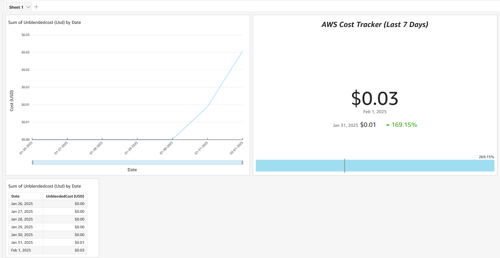
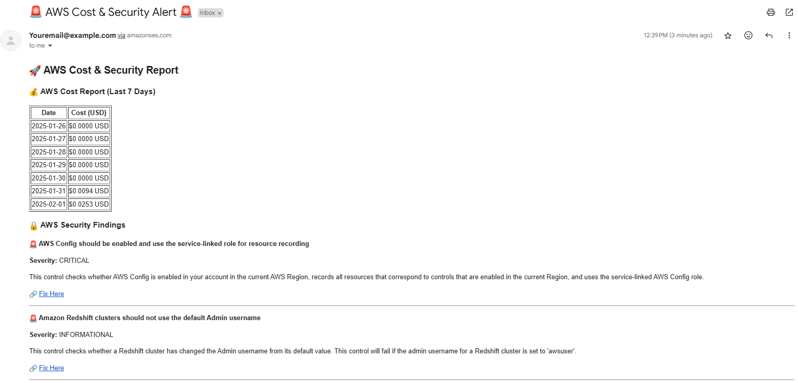

# AWS Cost Monitoring & Security Insights 🚀  

## 🔍 Overview  
This project automates **AWS cost monitoring** using **Terraform, AWS Lambda, and Amazon QuickSight**.  
It provides **real-time cost tracking**, **security insights**, and a **dashboard for visual analysis**.  

## 🛠️ Tech Stack  
- **AWS Lambda** → Automates cost and security data collection.  
- **Terraform** → Deploys AWS resources.  
- **Amazon S3** → Stores cost/security logs.  
- **AWS Cost Explorer API** → Retrieves cost usage data.  
- **Amazon QuickSight** → Visualizes cost trends.  
- **AWS SES (Simple Email Service)** → Sends cost alert emails.  

---

## 📊 Features  
✅ **Automated AWS Cost Tracking** (Daily updates)  
✅ **Email Alerts for High Spending** (via AWS SES)  
✅ **Security Insights** (AWS Security Hub Findings)  
✅ **Interactive Dashboard** (Amazon QuickSight)  
✅ **Terraform Infrastructure as Code** (Fully automated setup)  

---

## 📷 Dashboard Preview  
📊 **AWS Cost Tracking Dashboard (QuickSight)**  
  

✉️ **Example Email Alert (AWS SES)**  
_(Sent when costs exceed a threshold)_  
  

---

## 📊 How to Access QuickSight Dashboard
1️⃣ Go to Amazon QuickSight.
2️⃣ Select the S3 data source (aws-cost-monitoring-logs).
3️⃣ Visualize cost trends with charts & KPIs.
4️⃣ Customize filters to analyze different time periods.

---

## 📩 How the Email Alert Works
- The Lambda function runs daily.
- If AWS costs exceed $50, it sends an email alert.
- Example email format:
Subject: AWS Cost & Security Alert 🚨

Your AWS spending has exceeded $50 for the last 7 days.
Please review the QuickSight dashboard for more details.

✅ **Customize the spending threshold** inside `lambda_function.py`.  

---

## 🔒 Security & Environment Variables  
### **✅ Hide AWS Credentials & Emails**  
Instead of hardcoding values, use **AWS Lambda Environment Variables**:  

| Key              | Value (Example)             |
|-----------------|----------------------------|
| `SENDER_EMAIL`  | `youremail@example.com`     |
| `RECIPIENT_EMAIL` | `youremail@example.com`  |
| `AWS_REGION`    | `us-east-1`                 |
| `S3_BUCKET`     | `S3_Bucket_Name`            |

📌 **Set these inside AWS Lambda > Configuration > Environment Variables.**  

---

## 🏗️ Infrastructure Setup  
### **1️⃣ Clone this repository**  
```bash
git clone https://github.com/JDoo2002/aws-cost-monitoring.git
cd aws-cost-monitoring
```

### **2️⃣ Deploy AWS Resources (Terraform)**  
```bash
cd terraform
terraform init
terraform apply -auto-approve
```
✅ This will create **AWS Lambda, IAM Roles, S3 Bucket, and AWS Cost Explorer API access.**  

### **3️⃣ Deploy the Lambda Function**  
```bash
cd lambda
zip lambda_function.zip lambda_function.py
aws lambda update-function-code --function-name cost_optimizer --zip-file fileb://lambda_function.zip
```
✅ This updates the **AWS Lambda function.**  

---

## 🛠️ Troubleshooting  
### **1️⃣ No email alerts?**  
🔹 **Check AWS SES email verification.**  
_(Sandbox mode only allows sending to verified emails.)_  

🔹 **Check Lambda execution logs in AWS CloudWatch.**  

### **2️⃣ No QuickSight data?**  
🔹 **Ensure your S3 bucket is correctly configured** and contains the cost report file.  

🔹 **Double-check the `manifest.json` file** in QuickSight settings.  
